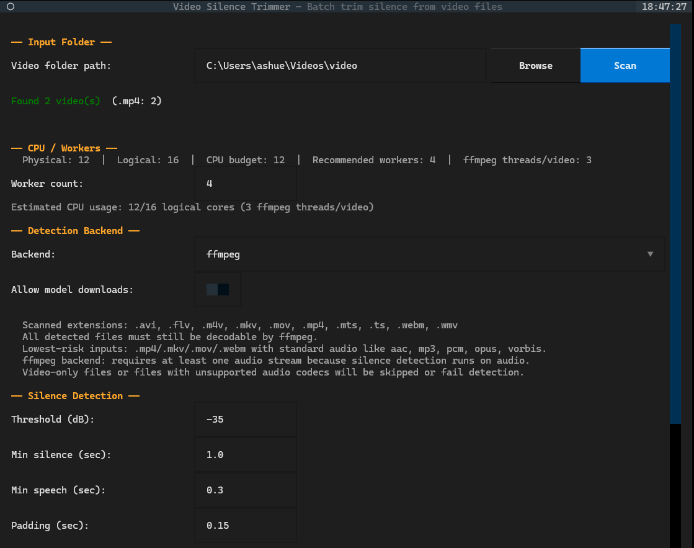
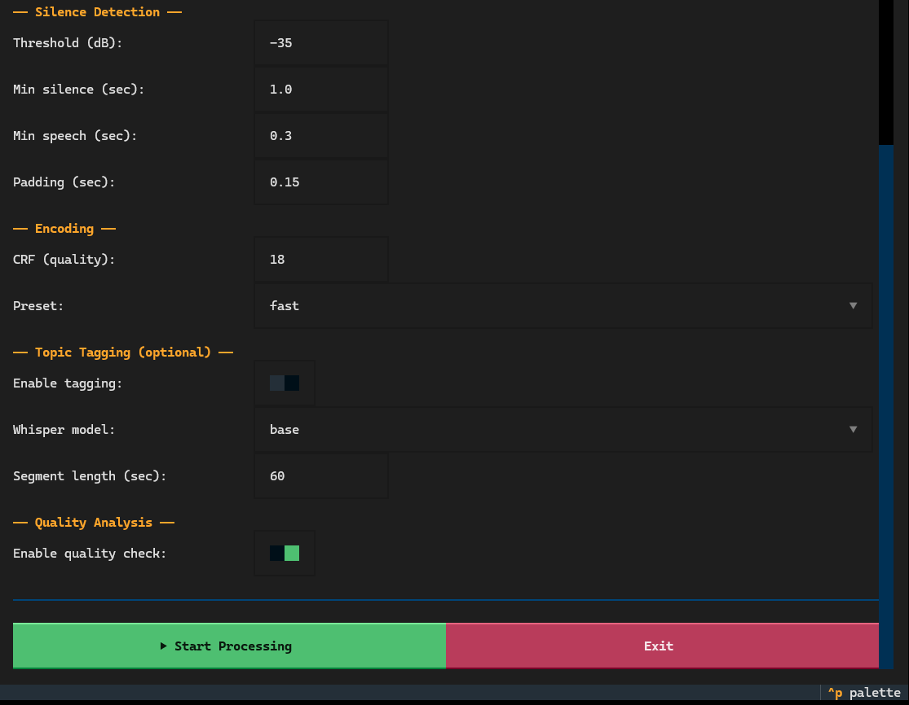

# Video Silence Trimmer

`Video Silence Trimmer` is a small desktop-style tool for cleaning up long recordings by cutting dead air out of videos in batches.

It is built for the kind of files people actually collect over time: recorded lectures, class sessions, screen recordings, training videos, meeting recordings, interview captures, and rough content that has too much waiting, pausing, or empty space.

## The Problem

A lot of useful recordings are much longer than they need to be.

Examples:

a. a classroom lecture where the teacher pauses for long stretches while writing on the board
b. a screen recording with long setup delays or waiting time
c. a meeting or interview recording with repeated dead air
d. study material recorded on a phone with uneven pacing

These files are still useful, but they are slower to review, harder to share, and frustrating to revisit.

## The Solution

This tool scans a folder of videos, detects silence or non-speech sections, and creates shorter trimmed versions in a `_trimmed_output` folder.

It offers two detection modes:

a. `ffmpeg`: a simpler audio-threshold based detector
b. `silero-vad`: a speech-aware detector that is usually better for spoken recordings

It also has a Textual TUI so the user can:

a. pick a folder
b. choose the backend
c. tune silence settings
d. watch progress live
e. review results after processing

## Common Use Cases

a. recorded lectures from class
b. tutoring sessions
c. online course screen recordings
d. meeting recordings
e. interview footage
f. self-recorded study explanations
g. raw video notes that need cleanup before sharing

## Requirements

The intended requirement is just:

a. Python 3.10+

The Windows launcher then takes care of the rest automatically.

## How To Run

From the project root on Windows:

```bat
.\silence_trimmer.bat
```

That opens the TUI after setup is complete.

If you want to run the CLI directly:

```bat
.\.venv_trimmer\Scripts\python.exe -m silence_trimmer --cli "<path\to\videos>"
```

## What The Build Script Installs Automatically

The launcher in `silence_trimmer.bat` is designed so the user does not have to manually install project dependencies one by one.

On first run it will:

a. create or repair the local virtual environment at `.venv_trimmer`
b. install the core Python packages for the app and TUI
c. provision local `ffmpeg` and `ffprobe` into `tools/ffmpeg` if they are not already available
d. install the Silero runtime dependencies
e. download and keep a local `silero-vad` copy beside the repo
f. install the tagging dependencies used for transcription and topic extraction

On later runs it reuses what is already present instead of downloading everything again.

## Output

Processed files are written into a sibling output folder inside the chosen input directory:

```text
input_folder/
├── <output_01>.mp4
├── <output_02>.mkv
└── _trimmed_output/
    ├── output_01_trimmed.mp4
    ├── output_02_trimmed.mp4
    └── _session_manifest.json
```

The trimmed file is still a normal video with audio for the kept sections. The silent parts are removed; the remaining video and audio are stitched together.

## Screenshots

### Main TUI



### Processing / Results



## Notes

a. `silero-vad` works best for spoken content.
b. Video-only files cannot be analyzed for silence and are skipped.
c. If tagging is enabled, the transcription model may still download its own model files on first use for the selected model size.
